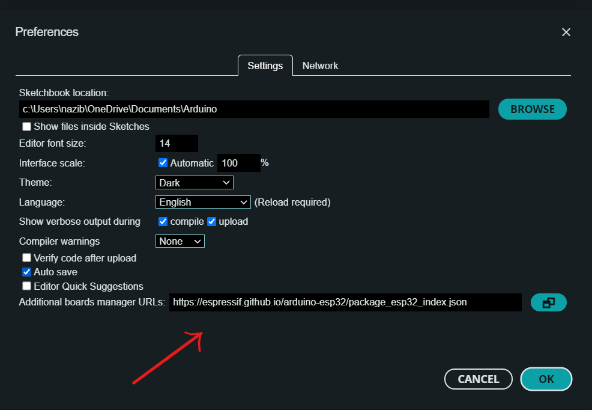

# JRC-Board-Guideline

## Setup

- Clone the github repository first using git:

  ```
  git clone https://github.com/JRCBoard/JRC-Board-Guideline.git
  ```

- Or download the zip file and Extract it:

  

### Install Arduino

- Download and install the latest version of arduino from https://www.arduino.cc/en/software

### Install VCP Driver

- Extract the `CDM212364_Setup.zip` and install the driver

### Install ESP32 Boards in Arduino Board Manager

- Go to the official installation instruction of esp32 manufacturer: https://docs.espressif.com/projects/arduino-esp32/en/latest/installing.html
  - Copy the stable release link of esp32 board manager from the website.
- Or, copy the link from below.
  ```
  https://espressif.github.io/arduino-esp32/package_esp32_index.json
  ```
- Open Arduino Software
- Go to `File > Preferences`
- Paste the board manager link into the `Additional boards manager URLs` field and click `Ok`.
  
- Restart Arduino IDE
- Goto `Tools > Board > Boards Manager`.
- Type `esp32` on the search bar

  

- Click the Install button selecting the latest version from the drop down.
